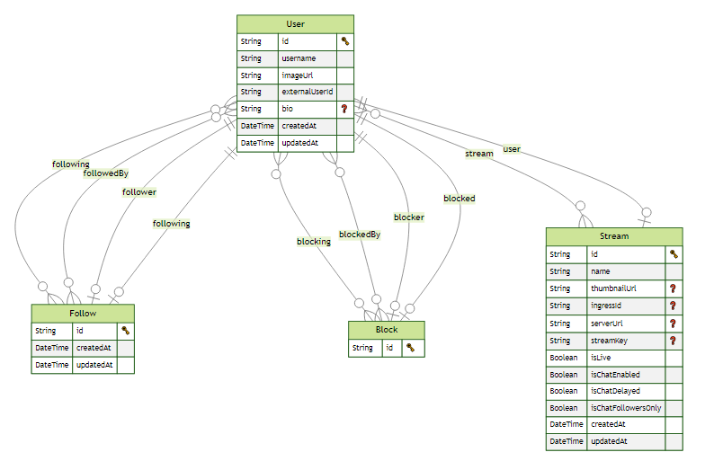

# Gamehub
- [Gamehub](#gamehub)
  - [Intro](#intro)
    - [Tech Used](#tech-used)
    - [ERD Diagram](#erd-diagram)
  - [Demo](#demo)
  - [Local Setup Steps](#local-setup-steps)
  - [Known Issues](#known-issues)

## Intro
A streaming platform featuring RTMP/WHIP protocols, authentication, real-time chat, live viewer count, and a robust dashboard for creators. The system includes unique color-coded chat, following, blocking, and real-time participant management. [Live Link](https://gamehub-peach.vercel.app/)

### Tech Stack Used
- Next.js and Typescript
- MySQL
- Tailwind CSS
- Shadcn ui components
- Clerk for Auth
- Livekit for streaming and particpant management
- Prisma ORM
- Zustand for local state management
- Upload thing for S3 File Uploads 

### ERD Diagram


## Demo
https://github.com/cchiragJain/gamehub/assets/59828850/e5a2d3c0-adf0-40ac-9e8d-274ab7d75169

## Local Setup Steps
- Clone the repo.
- Inside a terminal run `npm install`.(Created on node version 20.11) After the step is completed in a terminal run the command npm run dev. This will open a development server for you.
- You would also need to create a local `.env` file with the following keys. ( fill your own private keys for some of them ).
```env
NEXT_PUBLIC_CLERK_PUBLISHABLE_KEY=
CLERK_SECRET_KEY= 
NEXT_PUBLIC_CLERK_SIGN_IN_URL=/sign-in
NEXT_PUBLIC_CLERK_SIGN_UP_URL=/sign-up
NEXT_PUBLIC_CLERK_AFTER_SIGN_IN_URL=/
NEXT_PUBLIC_CLERK_AFTER_SIGN_UP_URL=/
CLERK_WEBHOOK_SECRET=
DATABASE_URL=
LIVEKIT_API_URL=
LIVEKIT_API_KEY=
LIVEKIT_API_SECRET=
NEXT_PUBLIC_LIVEKIT_WS_URL=
UPLOADTHING_SECRET=
UPLOADTHING_APP_ID=
```
## Known Issues
- There are some issues where `revalidatePath` is not working like changing chat settings needs a reload to take into effect for other users unlike participant management events from livekit.
- App is on free tier of livekit so there may be error in generating new ingresses/ keys on the creator dashboard. Contact me and I will give you the already created keys or create a new project.
- Some times the live banner is not coming on the dashboard page even when the user is live.
